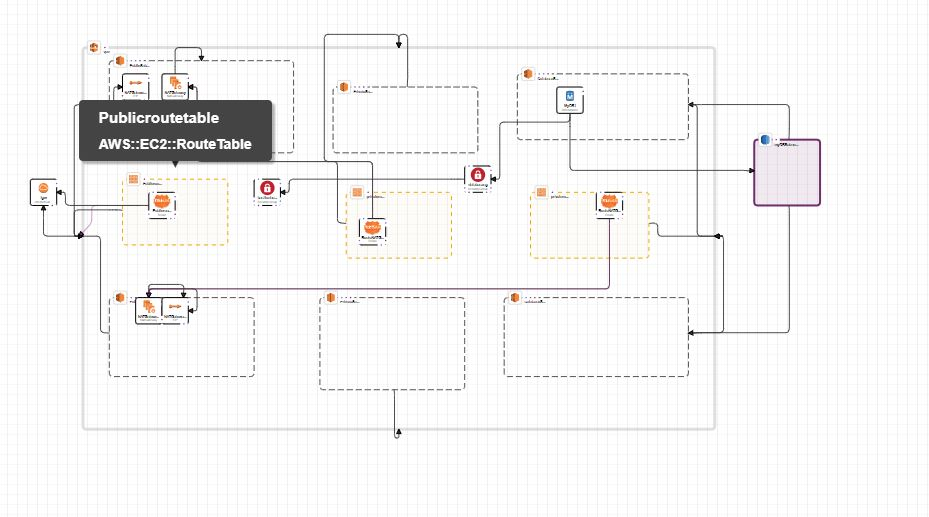

# This hands-on project will guide you through the process of migrating SQL data into an Amazon RDS database using FLYWAY.
This project will teach you how to set up the resources required to migrate data to RDS using FLYWAY. This includes configuring your VPC, Natgateway, securitygroup, RDS,Keypair,Bastion host, and FLYWAY. To use FLYWAY to migrate data into an RDS instance in the private subnet, first download and configure flyway on our computer, then launch a Bastion host in the public subnet. Once the Bastion host is launched in the public subnet, we will create an SSH tunnel to the RDS instance via the Bastion host. We will use flyway to migrate the data into the RDS database in the private subnet once the SSH tunnel is established.

STEP 1
## Building a 3-tier VPC with public and private subnets in two Availability Zones (AZs) using AWS CloudFormation can be done using the following steps:Building a 3-tier VPC with public and private subnets in 2 AZs

Create a CloudFormation template in JSON or YAML format that defines the resources for your VPC, including the VPC itself, subnets, security groups, Elastic IP addresses, load balancers, RDS instances, and EBS volumes.

### 1 Use the AWS::EC2::VPC resource type to define the VPC,


syntax:
```
  vpc:
    Type: 'AWS::EC2::VPC'
    Properties:
      CidrBlock: !Ref vpccidrblock
      EnableDnsSupport: 'true'
      EnableDnsHostnames: 'true'
      Tags:
        - Key: stack
          Value: production
```
check the [VPC AWS cloudformation documentation](https://docs.aws.amazon.com/AWSCloudFormation/latest/UserGuide/aws-resource-ec2-vpc.html) for more details.
 
### NOTE: 
The arrangement of the cloudformation template depends on the Metadata, you can always re-arrange to fit your style
click [more](https://github.com/AMUTEXKB/Migrating-data-into-RDS-using-Flyway/blob/main/flyway.yml) to see the full code   

### 2 Use the AWS::EC2::InternetGateway resource type to define the InternetGateway,and use the AWS::EC2::VPCGatewayAttachment resource type to associate them with the VPC.


syntax:
```
  igw:
    Type: 'AWS::EC2::InternetGateway'
    Properties: {}

  igwa:
    Type: 'AWS::EC2::VPCGatewayAttachment'
    Properties:
      VpcId: !Ref vpc
      InternetGatewayId: !Ref igw

```
check the [AWS cloudformation documentation](https://docs.aws.amazon.com/AWSCloudFormation/latest/UserGuide/AWS_EC2.html) for more details.
### 3 use the AWS::EC2::Subnet resource type to define the public, private and database subnets in each AZ.


syntax:
```
 PublicSubnetAZ1:
    Type: 'AWS::EC2::Subnet'
    Properties:
      VpcId:
        Ref: vpc
      CidrBlock: 10.0.0.0/24
      MapPublicIpOnLaunch: true
      AvailabilityZone: us-east-1a
      Tags:
        - Key: stack
          Value: production

  DatabaseSubnetAZ1:
    Type: 'AWS::EC2::Subnet'
    Properties:
      VpcId:
        Ref: vpc
      CidrBlock: 10.0.2.0/24
      AvailabilityZone: us-east-1a
      Tags:
        - Key: stack
          Value: production

  PrivateSubnetAZ1:
    Type: 'AWS::EC2::Subnet'
    Properties:
      VpcId:
        Ref: vpc
      CidrBlock: 10.0.1.0/24
      AvailabilityZone: us-east-1a
      Tags:
        - Key: stack
          Value: production

  PublicSubnetAZ2:
    Type: 'AWS::EC2::Subnet'
    Properties:
      VpcId:
        Ref: vpc
      CidrBlock: 10.0.3.0/24
      MapPublicIpOnLaunch: true
      AvailabilityZone: us-east-1b
      Tags:
        - Key: stack
          Value: production

  PrivateSubnetAZ2:
    Type: 'AWS::EC2::Subnet'
    Properties:
      VpcId:
        Ref: vpc
      CidrBlock: 10.0.4.0/24
      AvailabilityZone: us-east-1b
      Tags:
        - Key: stack
          Value: production

  DatabaseSubnetAZ2:
    Type: 'AWS::EC2::Subnet'
    Properties:
      VpcId:
        Ref: vpc
      CidrBlock: 10.0.5.0/24
      AvailabilityZone: us-east-1b
      Tags:
        - Key: stack
          Value: production
		  
```  
check the [AWS cloudformation documentation](https://docs.aws.amazon.com/AWSCloudFormation/latest/UserGuide/AWS_EC2.html) for more details.
        
### 4 Use the AWS::EC2::RouteTable resource type to define the Public RouteTable ,and use the AWS::EC2::Route resource type to connect the RouteTable to the InternetGateway.


syntax:
```
  Publicroutetable:
    Type: 'AWS::EC2::RouteTable'
    Properties:
      VpcId:
        Ref: vpc
      Tags:
        - Key: stack
          Value: production

  Publicroute:
    Type: 'AWS::EC2::Route'
    DependsOn: igwa
    Properties:
      RouteTableId:
        Ref: Publicroutetable
      DestinationCidrBlock: 0.0.0.0/0
      GatewayId:
        Ref: igw

```
check the [AWS cloudformation documentation](https://docs.aws.amazon.com/AWSCloudFormation/latest/UserGuide/AWS_EC2.html) for more details.

### 5 To associate the two public subnet we created earlier to the RouteTable we  use the AWS::EC2::SubnetRouteTableAssociation resource type to define the Public RouteTable .
syntax:
```
  publicSubnetRouteTableAssociationAZ1:
    Type: 'AWS::EC2::SubnetRouteTableAssociation'
    Properties:
      SubnetId: !Ref PublicSubnetAZ1
      RouteTableId:
        Ref: Publicroutetable
  publicSubnetRouteTableAssociation2:
    Type: 'AWS::EC2::SubnetRouteTableAssociation'
    Properties:
      SubnetId: !Ref PublicSubnetAZ2
      RouteTableId:
        Ref: Publicroutetable
```
check the [AWS cloudformation documentation](https://docs.aws.amazon.com/AWSCloudFormation/latest/UserGuide/AWS_EC2.html) for more details.

### 6 Use AWS::EC2::NatGateway resource type to create your NATGateway


syntax:
```
  NATGateway:
    Type: 'AWS::EC2::NatGateway'
    Properties:
      AllocationId: !GetAtt NATGatewayEIP.AllocationId
      SubnetId: !Ref PublicSubnetAZ1
      Tags:
        - Key: stack
          Value: production
  NATGatewayEIP:
    Type: 'AWS::EC2::EIP'
    Properties:
      Domain: vpc		  
```
check the [AWS cloudformation documentation](https://docs.aws.amazon.com/AWSCloudFormation/latest/UserGuide/AWS_EC2.html) for more details.

### 7 The next thing is to create a private RouteTable, Use AWS::EC2::RouteTable resource type to create your Private RouteTable, and use AWS::EC2::Route to route the traffic to the NATGateway.


syntax:
```
  privateroutetable:
    Type: 'AWS::EC2::RouteTable'
    Properties:
      VpcId:
        Ref: vpc
      Tags:
        - Key: stack
          Value: production
  RouteNATGateway:
    DependsOn: NATGateway
    Type: 'AWS::EC2::Route'
    Properties:
      RouteTableId: !Ref privateroutetable
      DestinationCidrBlock: 0.0.0.0/0
      NatGatewayId: !Ref NATGateway		  
```
check the [AWS cloudformation documentation](https://docs.aws.amazon.com/AWSCloudFormation/latest/UserGuide/AWS_EC2.html) for more details.

### 8 To associate the two Private subnet we created earlier to the RouteTable we  use the AWS::EC2::SubnetRouteTableAssociation resource type to define the Private RouteTable .

syntax:
```
  privateSubnetRouteTableAssociationAZ1:
    Type: 'AWS::EC2::SubnetRouteTableAssociation'
    Properties:
      SubnetId: !Ref PrivateSubnetAZ1
      RouteTableId:
        Ref: privateroutetable
```
check the [AWS cloudformation documentation](https://docs.aws.amazon.com/AWSCloudFormation/latest/UserGuide/AWS_EC2.html) for more details.

### 9 Repeat step 6,7,8 to create the services in the AZ2(Availability zone)


click [more](https://github.com/AMUTEXKB/Migrating-data-into-RDS-using-Flyway/blob/main/flyway.yml) to see the full code 

### 10 Use the AWS::EC2::SecurityGroup resource type to define the security groups for the public and private subnets,and Use the AWS::EC2::SecurityGroupIngress resource type to specify the inbound traffic rules.
To use flyway to migrate data into the RDS,you need two security group, the ssh security group that would be attached to our bastion host, the database security group that would be attached to our RDS and we would only allow traffic to this port that is coming from  the bastion host.


syntax:
```
  databasesg:
    Type: 'AWS::EC2::SecurityGroup'
    Properties:
      GroupDescription: Allow ssh to client database
      VpcId: !Ref vpc
      SecurityGroupIngress:
        - IpProtocol: tcp
          FromPort: 3306
          ToPort: 3306
          SourceSecurityGroupId: !Ref bastionhostsg

  bastionhostsg:
    Type: 'AWS::EC2::SecurityGroup'
    Properties:
      GroupDescription: Allow http to client host
      VpcId: !Ref vpc
      SecurityGroupIngress:
        - IpProtocol: tcp
          FromPort: 22
          ToPort: 22
          CidrIp: 102.89.23.192/32

```
check the [AWS cloudformation documentation](https://docs.aws.amazon.com/AWSCloudFormation/latest/UserGuide/AWS_EC2.html) for more details.

### 11 Before we create our database the first thing we have to specify is the subnet group, the subnet groups allow us to specify the subnet we want to create our database in.Use AWS::RDS::DBSubnetGroup to create your database subnet group


Syntax:
```
	myDBSubnetGroup:
		Properties:
		  DBSubnetGroupDescription: description
		  SubnetIds:
			- !Ref DatabaseSubnet1
			- !Ref DatabaseSubnet2
		  Tags:
			- Key: prod
			  Value: String
		Type: 'AWS::RDS::DBSubnetGroup'
```
check the [AWS cloudformation documentation](https://docs.aws.amazon.com/AWSCloudFormation/latest/UserGuide/AWS_EC2.html) for more details.

### 12 Use the AWS::RDS::DBInstance resource type to create the RDS services.


syntax:
```
  MyDB1:
    Type: 'AWS::RDS::DBInstance'
    Properties:
      DBInstanceIdentifier: !Ref DBInstanceID
      DBName: !Ref DBName
      DBInstanceClass: !Ref DBInstanceClass
      AllocatedStorage: !Ref DBAllocatedStorage
      Engine: MySQL
      EngineVersion: 8.0.28
      MasterUsername: !Ref DBUsername
      MasterUserPassword: !Ref DBPassword
      VPCSecurityGroups:
        - !Ref databasesg
      DBSubnetGroupName: !Ref myDBSubnetGroup
      AvailabilityZone: us-east-1a

```
check the [AWS cloudformation documentation](https://docs.aws.amazon.com/AWSCloudFormation/latest/UserGuide/AWS_EC2.html) for more details.

### 13 Use AWS::EC2::KeyPair to create a key pair that we would use to SSH into our instance


syntax:
```
  NewKeyPair:
    Type: 'AWS::EC2::KeyPair'
    Properties:
      KeyName: MyKeyPair
```	
check the [AWS cloudformation documentation](https://docs.aws.amazon.com/AWSCloudFormation/latest/UserGuide/AWS_EC2.html) for more details.
  
### 14 Use AWS::EC2::Instance to launch the bastion host that we would use to SSH into the RDS in the private subnet.


syntax:
```
  bastonhost:
    Type: 'AWS::EC2::Instance'
    Properties:
      InstanceType: t2.micro
      ImageId: !Ref imageami
      KeyName:
        Ref: NewKeyPair
      SecurityGroupIds:
        - Ref: bastionhostsg
      SubnetId: !Ref PublicSubnetAZ1
```	 
check the [AWS cloudformation documentation](https://docs.aws.amazon.com/AWSCloudFormation/latest/UserGuide/AWS_EC2.html) for more details.
 
### Use the cloudformation Parameter to specify the parameter used in the cloudformation template
syntax:
```
Parameters:
  vpccidrblock:
    Type: String
    Description: vpc cidr block
    Default: 10.0.0.0/16
  imageami:
    Type: String
    Description: Specify the instance AMI

    	
  DBInstanceID:
    Default: mydbinstance
    Description: My database instance
    Type: String
    MinLength: '1'
    MaxLength: '63'
    AllowedPattern: '[a-zA-Z][a-zA-Z0-9]*'
    ConstraintDescription: >-
      Must begin with a letter and must not end with a hyphen or contain two
      consecutive hyphens.
  DBName:
    Default: mydb
    Description: My database
    Type: String
    MinLength: '1'
    MaxLength: '64'
    AllowedPattern: '[a-zA-Z][a-zA-Z0-9]*'
    ConstraintDescription: Must begin with a letter and contain only alphanumeric characters.
  DBInstanceClass:
    Default: db.t2.micro
    Description: DB instance class
    Type: String
    ConstraintDescription: Must select a valid DB instance type.
  DBAllocatedStorage:
    Default: '50'
    Description: The size of the database (GiB)
    Type: Number
    MinValue: '20'
    MaxValue: '65536'
    ConstraintDescription: must be between 20 and 65536 GiB.
  DBUsername:
    NoEcho: 'true'
    Description: Username for MySQL database access
    Type: String
    MinLength: '1'
    MaxLength: '16'
    AllowedPattern: '[a-zA-Z][a-zA-Z0-9]*'
    ConstraintDescription: must begin with a letter and contain only alphanumeric characters.
  DBPassword:
    NoEcho: 'true'
    Description: Password MySQL database access
    Type: String
    MinLength: '8'
    MaxLength: '41'
    AllowedPattern: '[a-zA-Z0-9]*'
    ConstraintDescription: must contain only alphanumeric characters.
```
check the [AWS cloudformation documentation](https://docs.aws.amazon.com/AWSCloudFormation/latest/UserGuide/AWS_EC2.html) for more details.

### Use the AWS::CloudFormation::Stack resource type to create or update the stack, specifying the template and parameter values.


### Test your CloudFormation stack and make any necessary adjustments.

## Upon successful deployment,the next step is to download flyway on our system.
Flyway is a database migration tool that can be used to manage and apply database changes. To download Flyway on your system, you can follow these steps:

1. Go to the Flyway website (https://flywaydb.org/) and click on the "Download" button.

2. Choose the version of Flyway that you want to download, depending on your operating system and architecture.

3. Download the Flyway executable file for your operating system, either .zip or .tar.gz format.

4. Extract the executable file from the archive.

5. Move the executable file to a directory that is in your system's PATH. This will allow you to run Flyway from any directory.

6. You can verify that Flyway is installed correctly by running the command flyway -version in the command line.

7. Once you have Flyway installed, you can then use the command line tool to configure, migrate and validate your database.
